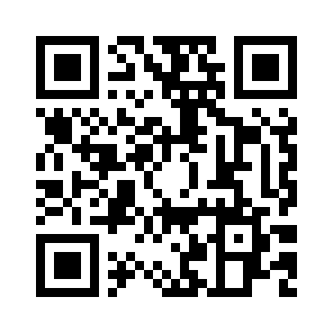

## 📱 웹에서 바로 실행하기 (Web App)

스마트폰 카메라로 아래 QR 코드를 스캔하거나 [웹 앱 바로가기](https://logic4rest.github.io/hamster/) 링크를 클릭하세요.




엑스배너: https://canva.link/7ysacp79v9o0zj2
ppt: https://canva.link/xlx3rn9imihmi3i

# 🐹 햄스터 로봇 AI 스마트 4종 분리배출 자율주행 시스템 (v4.3 최적화 마스터 에디션)

웹캠 카메라를 통해 **쓰레기 4종(종이, 종이팩, 패트병/플라스틱, 캔)** 및 **오배출 경고 품목(이물질/라벨)**을 실시간으로 감지하고, **사용자가 화살표 키로 조종하여 엔터로 지정 번호 슬롯(1:종이, 2:종이팩, 3:패트병, 4:캔)에 기억시킨 위치**로 이동하며, **전방 적외선 센서로 장애물 발견 시 자동으로 우회 회피 주행**하여 실물 집게로 쓰레기를 분리수거하는 통합 AI 로봇 시스템입니다.

> 💡 **업데이트 (v4.3)**: 패트병과 플라스틱의 신뢰도 향상을 위해 **유리병 항목을 완전히 제거하고 패트병/플라스틱으로 통합**하였습니다.

---

## ✨ 핵심 기능 4대 통합 완성

1. **🔢 4종 지정 슬롯 위치 기억 (1:종이, 2:종이팩, 3:패트병, 4:캔)**:
   - 햄스터를 시작 위치에 두고 **1~4번 중 원하는 쓰레기 슬롯 번호**를 선택합니다.
   - 키보드 **화살표 키(`↑`, `↓`, `←`, `→`)**로 실제 분리수거함 위치까지 직접 운전한 뒤 **`Enter (엔터)`**를 누르면 해당 번호 슬롯으로 정밀 저장됩니다!

2. **🤖 카메라 감지 시 해당 번호 슬롯 위치로 자율 이동 (Autonomous Replay)**:
   - 카메라에 **종이** ➔ 1번 위치 자율 이동
   - 카메라에 **종이팩** ➔ 2번 위치 자율 이동
   - 카메라에 **패트병/플라스틱** ➔ 3번 위치 자율 이동
   - 카메라에 **캔** ➔ 4번 위치 자율 이동

3. **⚠️ 전방 적외선 센서 장애물 감지 & 지능형 자동 우회 주행 (Smart Obstacle Detour)**:
   - 로봇이 이동하는 도중 앞쪽에 상자, 손, 물건 등 **장애물이 나타나면 전방 센서(`left_proximity`, `right_proximity`)가 즉시 감지**합니다.
   - 삐! 소리와 함께 **장애물을 옆으로 슥 비켜서 돌아간(우회한) 후**, 원래 목표인 수거함까지 끝까지 찾아갑니다!

4. **🦾 roboid 공식 실물 집게 자동 포획 & 해제**:
   - `open_gripper()`, `close_gripper()`, `release_gripper()` 공식 API 적용.

---

## 🎨 쓰레기 4종 분리배출 & 수거 반응 안내표

| 슬롯 번호 | 쓰레기 범주 | 확정 조건 | 실물 집게 & 자율주행 반응 | LED 표시 색상 |
| :---: | :--- | :---: | :---: | :---: |
| **`1`** | **종이** | 연속 4프레임 (신뢰도 ≥ 0.8) | **집게 포획 ➔ 🗺️ 1번 위치 이동 (장애물 자동 우회!) ➔ 배출 ➔ 복귀** | **노란색 LED** 🟡 (`yellow`) |
| **`2`** | **종이팩 (우유팩)** | 연속 4프레임 (신뢰도 ≥ 0.8) | **집게 포획 ➔ 🩵 2번 위치 이동 (장애물 자동 우회!) ➔ 배출 ➔ 복귀** | **하늘색 LED** 🩵 (`cyan`) |
| **`3`** | **패트병 / 플라스틱** | 연속 4프레임 (신뢰도 ≥ 0.8) | **집게 포획 ➔ 🥤 3번 위치 이동 (장애물 자동 우회!) ➔ 배출 ➔ 복귀** | **파란색 LED** 🔵 (`blue`) |
| **`4`** | **캔** | 연속 4프레임 (신뢰도 ≥ 0.8) | **집게 포획 ➔ 🥫 4번 위치 이동 (장애물 자동 우회!) ➔ 배출 ➔ 복귀** | **초록색 LED** 🟢 (`green`) |
| - | **이물질 (오배출 경고)** | 연속 4프레임 (신뢰도 ≥ 0.8) | **🚨 경고 삐(Beep) 소리 + 집게 열고 후진 퇴거** | **빨간색 경고 LED** 🔴 (`red`) |
| - | **대기 / 미인식** | 신뢰도 < 0.8 | 대기 유지 | **LED OFF** ⚪ (`off`) |

---

## 🚀 빠른 시작 가이드

### 1단계: 화살표 키로 4종 위치 조종하고 엔터로 지정 저장하기
```bash
uv run python tools/record_paper_path.py
```
1. 1(종이), 2(종이팩), 3(패트병), 4(캔) 중 저장할 번호를 선택합니다.
2. 키보드 **화살표 키(`↑`, `↓`, `←`, `→`)**로 해당 수거함까지 운전합니다.
3. 도착하면 **`Enter (엔터)`** 키를 누릅니다. (저장 후 시작 위치로 자동 복귀)

---

### 2단계: AI 스마트 감지 & 전방 장애물 우회 자율주행 실행
```bash
uv run python main.py
```
- 카메라에 쓰레기를 비추면:
  1. 집게로 쓰레기를 잡습니다 (`close_gripper()`).
  2. **저장된 번호 위치로 로봇이 알아서 이동**합니다.
  3. **이동 중간에 장애물이 있으면, 전방 센서로 알아서 슥 피해서(우회해서)** 수거함까지 안전하게 찾아갑니다!
  4. 쓰레기를 넣고 (`release_gripper()`), 다시 원래 자리로 복귀합니다.
